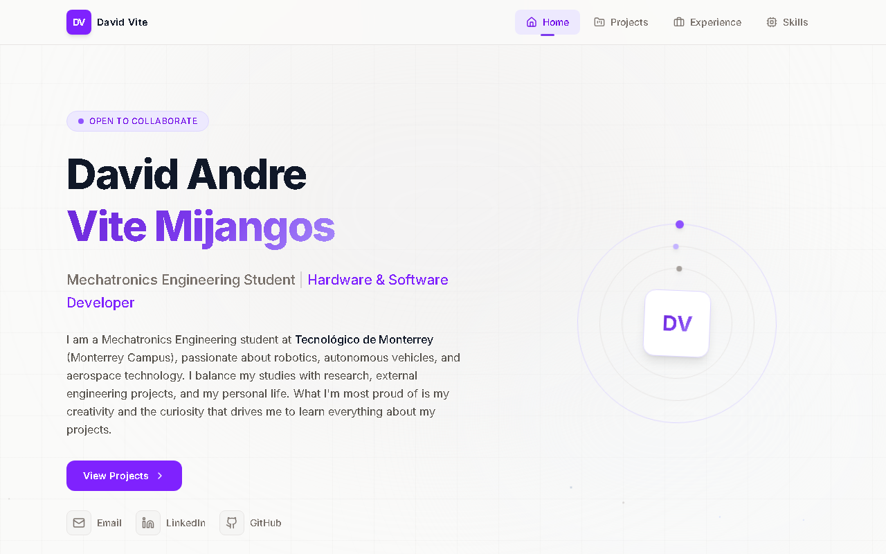

# David Vite — Engineering Portfolio

Personal portfolio of **David Andre Vite Mijangos**, Mechatronics Engineering student at Tecnológico de Monterrey: robotics, aerospace and embedded-systems projects, research, and experience, with photo, video and CAD evidence for each.

## Demo

**Live:** https://davidavitemijangos7.github.io/



## Problem

A CV lists skills; it doesn't show them. This site links every project and skill to evidence you can check: CAD renders, FEA stress maps, lab photos, test videos, and certificates. It's a static site that deploys for free on GitHub Pages.

## Install

Requires Node.js 20+.

```bash
git clone https://github.com/DavidAViteMijangos7/DavidAViteMijangos7.github.io.git
cd DavidAViteMijangos7.github.io
npm install
```

## Usage

| Command | What it does |
|---|---|
| `npm run dev` | Dev server with hot reload at http://localhost:5173 |
| `npm run build` | Production build into `dist/` (also writes `dist/404.html` for SPA routing) |
| `npm run preview` | Serves the built `dist/` at http://localhost:4173 (run before every push) |

Deployment is automatic: every push to `main` runs `.github/workflows/deploy.yml` (`npm ci` → `npm run build` → GitHub Pages). In the repo, set **Settings → Pages → Source** to **GitHub Actions**.

## Architecture

React 19 + Vite 6 + Tailwind CSS 4 + react-router-dom 7 + lucide-react.

```
├── .github/workflows/deploy.yml   # CI: build + deploy to GitHub Pages
├── public/                        # Served as-is from the site root
│   ├── images/<project>/          # Web-ready photos & renders (lowercase-hyphen names)
│   ├── videos/<project>/          # Web-ready .mp4 clips
│   ├── certificates/              # Certificate images
│   └── favicon.svg
├── scripts/spa-404.cjs            # Copies dist/index.html → dist/404.html after build
├── src/
│   ├── data/media.js              # Media manifest — every image/video the site shows
│   ├── components/
│   │   ├── MediaGallery.jsx       # Thumbnail grid (images + videos) → Lightbox
│   │   ├── Lightbox.jsx           # Full-screen viewer: ←/→/Esc, caption, n / total
│   │   ├── Navbar.jsx
│   │   └── ParticleField.jsx
│   ├── pages/                     # Home, Projects, Experience, Skills (data at the top of each file)
│   ├── App.jsx                    # Routes + layout
│   └── main.jsx
├── index.html                     # Meta / Open Graph tags
└── vite.config.js                 # base: '/' (user site)
```

`Photos/` holds the raw originals and is git-ignored. Code never references it.

### Add a photo or video

1. Export a web-ready copy (≤ ~1600 px wide, ≤ ~500 KB) into `public/images/<project>/` or `public/videos/<project>/`. Use **lowercase names with hyphens**: GitHub Pages is case-sensitive, even though Windows isn't.
2. Add an entry to the matching array in `src/data/media.js`:
   ```js
   { src: '/images/<project>/rover-arm-1.jpg', alt: 'What it shows' },
   { src: '/videos/<project>/test-1.mp4', alt: 'What it shows', type: 'video' },
   ```
   The `alt` text doubles as the lightbox caption. The empty `hobbies` / `culture` arrays hide their grids until you add something.

### Add a project

Add an object to the `projects` array at the top of `src/pages/Projects.jsx` (`id`, `title`, `subtitle`, `icon`, `technologies`, `description`, `highlights`). For a gallery, add a new key to `media.js` and set `media: media.<key>` on the project.

## Results

- 4 routes (`/`, `/projects`, `/experience`, `/skills`) that survive refresh on GitHub Pages via the `404.html` fallback
- 15 photos/renders, 3 test videos and 5 certificate images wired from one manifest, with no placeholder or broken paths
- One shared gallery/lightbox instead of three copy-pasted modals
- Production JS bundle ≈ 293 kB (≈ 90 kB gzipped)

This is a web project, so it doesn't use the `template-python` / `template-cpp` starters from my other repos.

## License

[MIT](LICENSE) © 2026 David Andre Vite Mijangos
